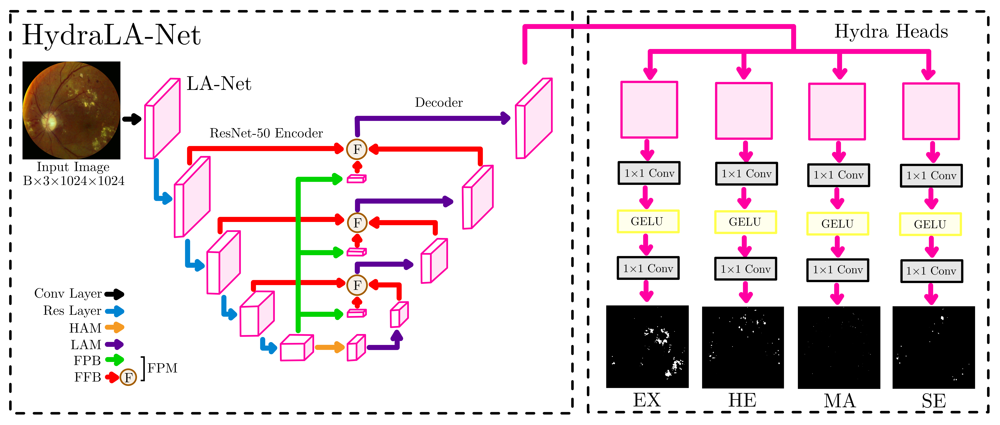

# **Progressive Optimization of HydraLA-Net for Microaneurysm Segmentation @ WAT.ai**

This project investigates techniques for improving microaneurysm segmentation in diabetic retinopathy fundus imaging, where lesions are extremely small and often low-contrast relative to surrounding tissue. We experiment on an adapted version of a previously established segmentation model for diabetic retinopathy, LA-Net, into HydraLA-Net.

Read the Paper [HERE!](Progressive_Optimization_of_HydraLA_Net_for_Microaneurysm_Segmentation.pdf)

*Model Architecture Hand-Drawn by Michael Liu using Goodnotes and Inkscape*

### Project Contributors
**Jessica Yuan**
- Technical Project Manager

**Michael Liu**
- Defined and Finalized the Primary Research Objective
- Model Architecture and Model Modifications
- Model Training (WATGPU via SSH)
- Loss Functions and Class-Imbalance Strategy
- Dataset Curation, Preprocessing & Augmentations
- Metrics Design & Evalutation Protocols
- Documentation (README.md)
- Drafting of the Final Published Research Paper
- Consulted on Dataset Clarifications with University of Waterloo School of Optometry Faculty Members

**Andrew Yang**
- Defined and Finalized the Primary Research Objective
- Model Training (WATGPU via SSH)
- Model Architecture Selection
- Model Architecture Visualization and Figures for Research Paper
- Literature Review and Research on Related Works
- Dataset Curation
- Drafting of the Final Published Research Paper

**Christopher Risi**
- Technical Support

**William Chiu**

**Tom Almog**

**Sidharth Shah**

**Apisan Kaneshan**

### Overview

This repository contains work in progress on the **semantic segmentation of microaneurysms, hemorrhages, soft exudates, and hard exudates** (lesions resulting from Diabetic Retinopathy) from fundus images. In addition to building the full segmentation pipeline, the project also conducts experimentation on techniques for enchancing the detection of microaneurysms. 

---

### Research Focus
Our research primarily focuses on:
- **Contrast enhancement strategies** to improve lesion visibility, including channel-aware selective preprocessing (CASP) and local contrast normalization (CLAHE).
- **Training-time techniques** to improve sensitivity to small structures, including loss functions designed to emphasize microaneurysm recall.

---

### Project Status/Progress (as of Feb 28 2026)
- [x] Dataset Curation 
- [x] Preprocessing and Augmentation Pipelines
- [x] Loss Function Development 
- [x] Data Visualizations
- [x] HydraLA-Net Implementation in PyTorch
- [x] Training Scripts 
- [x] Part 1: Baseline Training
- [x] Part 2: Preprocessing Variation Analysis
- [x] Part 3: Class Imbalance Aware Loss Function Analaysis
- [x] Part 4: Individual Dataset Analysis
- [x] Get results on testing sets
- [X] Publish research paper!

---

### Model 
The segmentation architecture used in this project is based directly on the original research paper that introduced it. 
* **LA-Net** Paper: [Lesion-Aware Network for Diabetic Retinopathy Diagnosis](https://arxiv.org/abs/2408.07264) 

The GitHub repository containing the experiment conducted in the paper above can be found at:
[LANet-DR GitHub Repo](https://github.com/xia-xx-cv/LANet-DR/)

Additionally, a full dynamic implementation of our adapted HydraLA-Net can be found in this repository.

---

### Datasets
Three datasets are chosen for the project. All datasets contain fundus images and segmentation masks for microaneuryms, hemorrhages, soft exudates, and hard exudates. The IDRiD and DDR datasets contain the masks in the binary form. The TJDR dataset contains the masks as a image with color mappings.
* **IDRiD**: [Indian Diabetic Retinopathy Dataset from Kaggle](https://www.kaggle.com/dataset/saaryapatel98/indian-diabetic-retinopathy-image-dataset)
* **DDR**: [Diabetic Retinopathy Lesion Segmentation and Lesion Detection Dataset from GitHub](https://github.com/nkicsl/DDR-dataset/tree/master)
* **TJDR**: [TJDR: A High-Quality Diabetic Retinopathy Pixel-Level Annotation Dataset from GitHub](https://github.com/NekoPii/TJDR)

Dataset Pixel Distributions by Class

